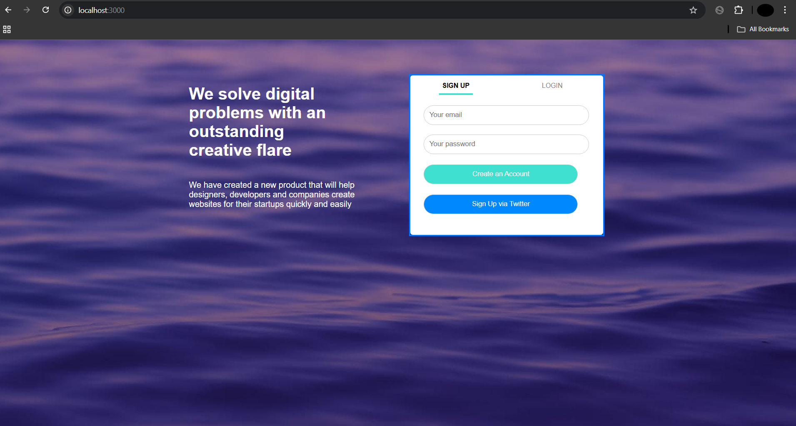

# 🔐 Authentication Portal with Twitter OAuth


A secure authentication system with local email/password and Twitter OAuth 2.0 integration, built with Node.js and Express.

## ✨ Features

- 🔒 Dual authentication system (Local + Twitter OAuth)
- 📱 Responsive design with mobile support
- 🎨 Modern UI with tabbed interface
- 🛡️ Secure password hashing with bcrypt
- 📊 PostgreSQL database integration
- 🚀 Session-based authentication
- 🖼️ Background image customization

## 🛠️ Installation

1. Clone the repository:
```bash
git clone https://github.com/priyam4501/LOGIN-APP.git
cd authentication-portal
```

2. Install dependencies:
```bash
npm install
```

3. Set up environment variables:

First create a `.env.example` file with the template below, then copy it to `.env`:
```bash
echo "PG_USER=your_postgres_user
PG_HOST=localhost
PG_DATABASE=your_database_name
PG_PASSWORD=your_postgres_password
PG_PORT=5432
SESSION_SECRET=your_session_secret
TWITTER_CLIENT_ID=your_twitter_client_id
TWITTER_CLIENT_SECRET=your_twitter_client_secret
TWITTER_CALLBACK_URL=http://localhost:3000/auth/twitter/secrets" > .env.example

cp .env.example .env
```
Then edit the `.env` file with your actual credentials. The `.env` file stores sensitive configuration separately from your code.

## 🚀 Usage

1. Start the development server:
```bash
npm start
```

2. Access the application at:
```
http://localhost:3000
```

## 📸 Screenshots

| Login Page | Secrets Page |
|------------|--------------|
|  |  |

## 🧩 Technology Stack

- **Backend**: Node.js, Express
- **Database**: PostgreSQL
- **Authentication**: Passport.js (Local + Twitter OAuth 2.0)
- **Frontend**: EJS templates
- **Styling**: CSS with responsive design
- **Security**: bcrypt for password hashing

